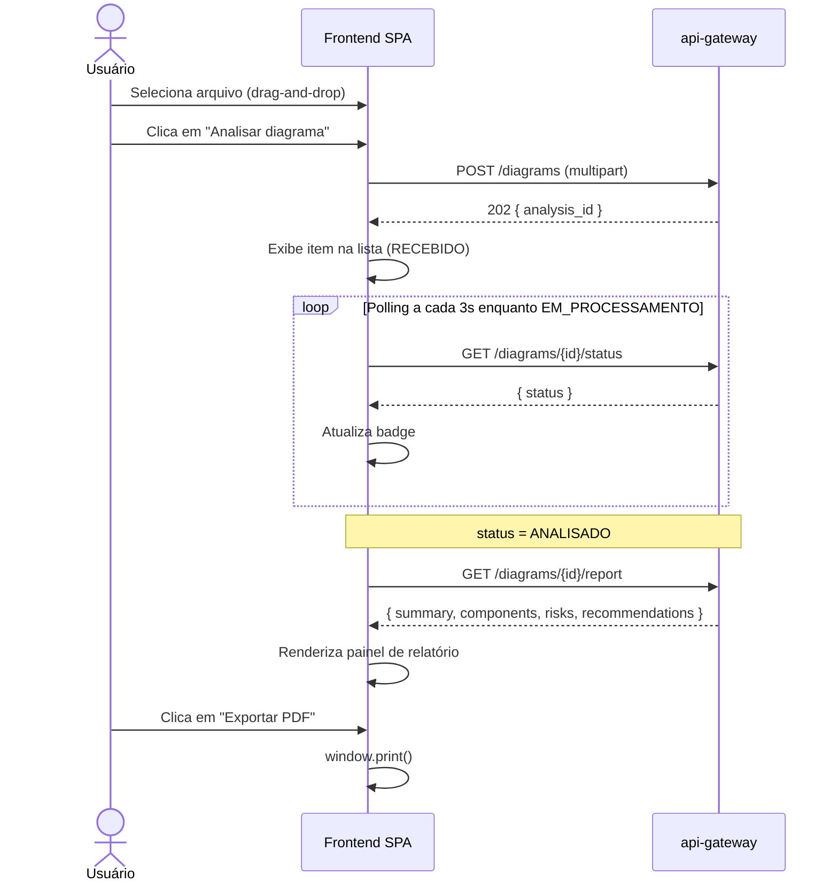

# fiap-hackathon-frontend

Interface web do Architecture Diagram Analyzer. SPA estática (HTML + CSS + JS vanilla), distribuída via Amazon CloudFront, sem dependências de framework ou build step.

## Funcionalidades

- Upload de diagramas de arquitetura (PDF, PNG, JPG/JPEG) via drag-and-drop ou seleção de arquivo
- Listagem de análises com atualização automática de status em tempo real
- Exibição do relatório gerado: sumário, componentes identificados, riscos e recomendações
- Exportação do relatório para PDF via impressão do navegador
- Design responsivo (desktop e mobile)

## Status de análise

| Status | Descrição |
|--------|-----------|
| `RECEBIDO` | Arquivo recebido e enfileirado para processamento |
| `EM_PROCESSAMENTO` | Claude está analisando o diagrama |
| `ANALISADO` | Relatório disponível |
| `ERRO` | Falha durante o processamento |

## Configuração da API

A URL do backend está declarada na linha inicial do bloco `<script>` do `index.html`:

```js
const API = 'https://<seu-cloudfront-domain>';
```

Para desenvolvimento local aponte para o api-gateway:

```js
const API = 'http://localhost:8000';
```

## Endpoints consumidos

| Método | Rota | Descrição |
|--------|------|-----------|
| `POST` | `/diagrams` | Envia arquivo para análise |
| `GET` | `/diagrams` | Lista todas as análises |
| `GET` | `/diagrams/{id}/status` | Consulta status de uma análise |
| `GET` | `/diagrams/{id}/report` | Obtém o relatório completo |

## Diagrama



## Como usar localmente

Não há build step. Sirva o arquivo diretamente:

```bash
# Python (qualquer versão)
python -m http.server 3000 --directory .

# Node.js (npx)
npx serve . -p 3000
```

Acesse `http://localhost:3000`.

> Lembre-se de ajustar `const API` para `http://localhost:8000` antes de servir localmente, e de ter o sistema completo rodando via docker-compose.

## Deploy em produção

O frontend é hospedado no S3 e distribuído pelo CloudFront. O upload dos arquivos é feito pelo workflow de CI do repositório `fiap-hackathon-infra`:

```bash
# Após terraform apply, copie o nome do bucket e o ID da distribuição dos outputs:
# frontend_bucket_name       → FRONTEND_BUCKET (GitHub Secret)
# cloudfront_distribution_id → CLOUDFRONT_DIST_ID (GitHub Secret)
```

O deploy é executado automaticamente via GitHub Actions a cada push em `main` do repositório de infra.

## Arquitetura completa e orquestração

Para rodar o sistema completo (todos os serviços + infraestrutura), consulte o repositório de documentação:

**[fiap-hackathon-docs](../fiap-hackathon-docs)** — contém `docker-compose.yml`, `.env.example` e instruções de setup do ambiente completo.
